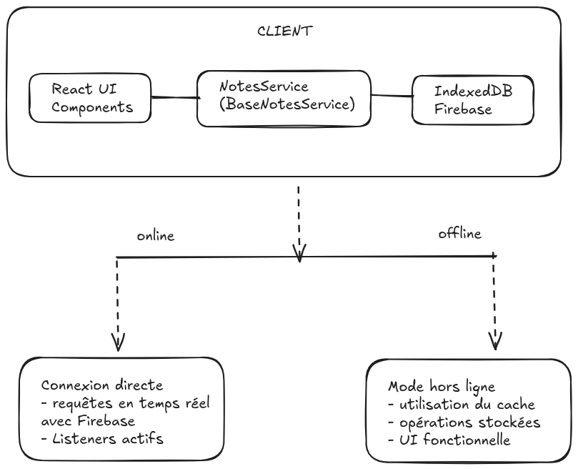

# [Application de prise de notes réactive](https://notesapp-f639b.web.app/)


## Technologies

- [react](https://fr.legacy.reactjs.org/docs/getting-started.html)
- [typescript](https://www.typescriptlang.org/)
- [tailwind css](https://tailwindcss.com/)
- [firebase](https://firebase.google.com/)
- [docker-compose](https://docs.docker.com/)

## Fonctionnalités

- authentification
  - inscription / connexion
    - email + mot de passe (auth Firebase)

- Un utilisateur authentifié pourra:
  - modifier / créer / supprimer / partager des notes (de cours, résumés de livres...)
  - créer des notes (publiques / privées)
  - lister, modifier, supprimer ses notes
  - rechercher et accéder aux notes (les siennes, celles mises en favoris et celles publiques)
  - filtrer par tag (ex.: #javascript, #java...)
  - trier par date de modification / ordre alphabétique
  - Un utilisateur anonyme pourra seulement consulter les notes publiques

- syncronisation en temps réel avec les listeners Firebase

- mode offline (application utilisable hors ligne)
  - méchanisme de caching automatique avec Firebase et IndexedDB
  - requêtes servies depuis le cache si l'utilisateur est hors ligne
  - synchronisation automatique des notes avec le serveur dès que la connexion est rétablie

## À faire

- rénitialisation de mot de passe
- départage de notes
- gestion robuste des appels firebase en mode offline
- gestion des sessions
- tests...

## Architecture



### Installation

```bash

docker compose build --no-cache
docker compose up

# docker-compose up -d
# docker-compose down -v

# OU
# $ npm -v
# 10.9.2
# $ node -v
# v22.14.0

npm install
npm run dev
```

### Fonctionnement hors ligne

Fonctionnement hors ligne
Détection automatique de l'état de la connexion réseau
Caching intelligent des données avec IndexedDB
File d'attente d'opérations pendant la période hors ligne
Synchronisation automatique lors de la reconnexion
Interface utilisateur réactive indiquant l'état de synchronisation

### Déploiement

```bash
# firebase deploy --only firestore:rules
npm run build
firebase deploy --only hosting
```

La version de développement est accessible sur [http://localhost:5173/](http://localhost:5173/); Celle déployée avec firebase est accessible sur [https://notesapp-f639b.web.app/](https://notesapp-f639b.web.app/)

#### Ressources

- [mockup excalidraw](./rsrc/mock.png)
- [schémas de la base de données](./rsrc/DB.png)

#### Autres ressources

- [projet react-ts avec vite](https://vite.dev/guide/)
- [ajouter tailwind css](https://tailwindcss.com/docs/installation/using-vite)
- [ajouter de firebase](https://dev.to/sahilverma_dev/firebase-with-react-and-typescript-a-comprehensive-guide-3fn5)

- docker
  - <https://www.docker.com/blog/how-to-dockerize-react-app/>
  - <https://docs.docker.com/reference/samples/>
  - <https://dev.to/nandhakumar/step-by-step-guide-to-dockerize-react-app-created-using-vite-2jg3>

- structure
  - <https://blog-ux.com/quest-ce-que-latomic-design/>

- vite
  - <https://vite.dev/guide/env-and-mode>

- tailwind
  - <https://tailwindflex.com/@anonymous/tailwind-header>
  - <https://tailwindflex.com/@r-thapa/simple-login-form-2>
  - <https://tailwindflex.com/@prajwal/forgot-password-form-fullscreen>
  - <https://pagedone.io/docs/buttons>

- react
  - <https://www.squash.io/passing-parameters-to-components-in-reactjs-with-typescript/>
  - <https://dev.to/franciscomendes10866/passing-props-to-child-components-in-react-using-typescript-2690>
  - <https://dev.to/abhay_yt_52a8e72b213be229/optimizing-react-performance-with-usecallback-memoizing-functions-to-prevent-unnecessary-re-renders-3687>
  - <https://www.reddit.com/r/javascript/comments/by0tz0/passing_callbacks_using_react_hooks_without/>
  - <https://dev.to/johnschibelli/advanced-react-hooks-custom-hooks-and-performance-optimization-21nl>
  - <https://medium.com/@edekobifrank/building-an-offline-first-notes-app-with-react-df2d92e7a6c7>
  <https://medium.com/@leanlauri/offline-first-note-app-pwa-react-hooks-flow-bootstrap-part-1-da210e5e1f07>
  - <https://www.youtube.com/watch?app=desktop&v=OKIaDk8sIbM>

- icons
  - <https://fonts.google.com/icons>
  - <https://www.flaticon.com/free-icons/star>
    - `<a href="https://www.flaticon.com/free-icons/star" title="star icons">Star icons created by Pixel perfect - Flaticon</a>`

- firebase
  - <https://github.com/firebase/quickstart-js/tree/master>
  - <https://firebase.google.com/docs/auth/web/manage-users>

- <https://regex101.com/>
- <https://www.google.com/search?q=How+to+save+extra+info+during+user+signup+process+using+firebase+authentication&oq=How+to+save+extra+info+during+user+signup+process+using+firebase+authentication&gs_lcrp=EgZjaHJvbWUyBggAEEUYOTIGCAEQRRg80gEHNDMwajBqN6gCALACAA&sourceid=chrome&ie=UTF-8>

- <https://www.goodreads.com/quotes>
